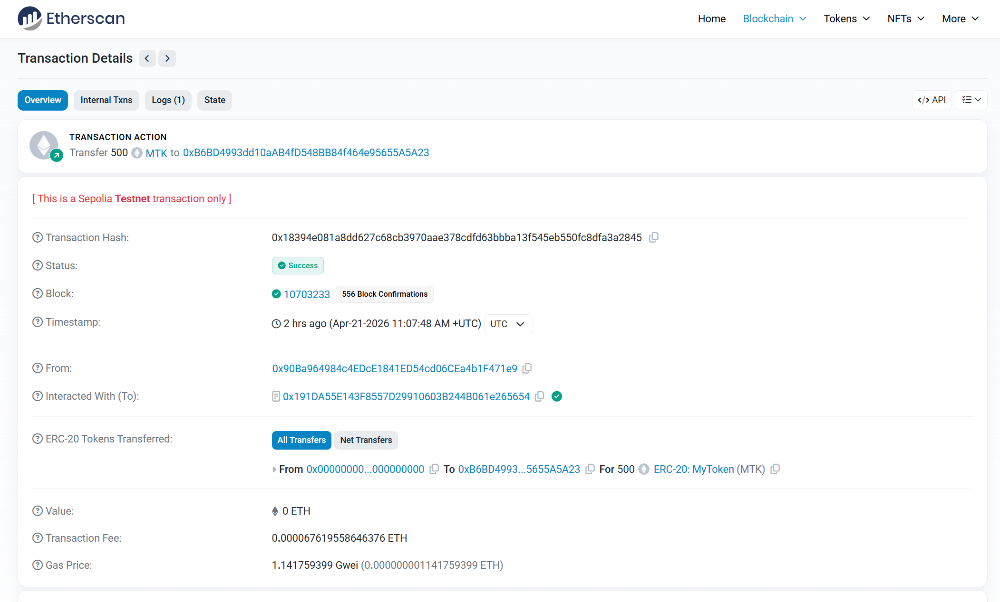
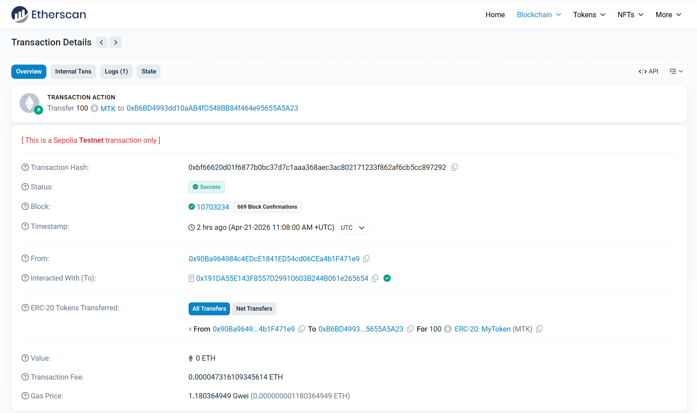
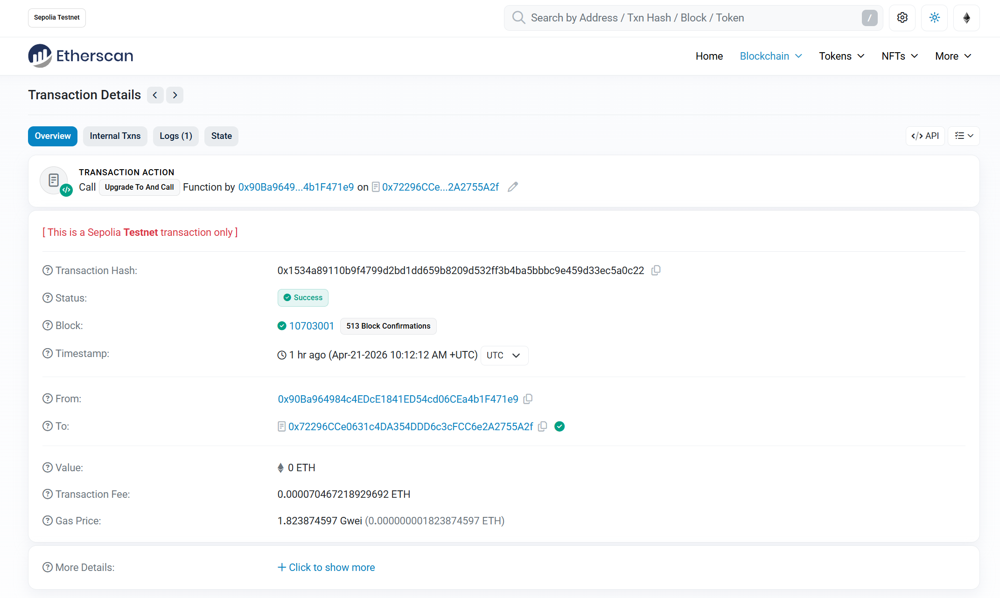
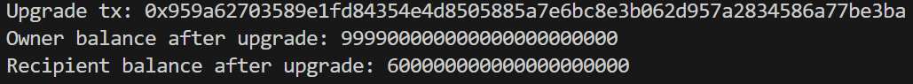
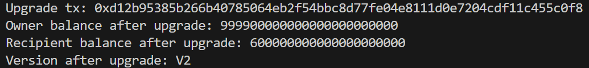
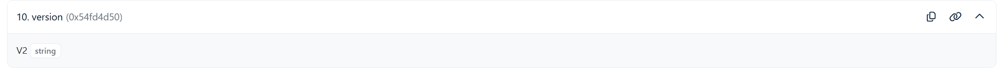

# Upgradeable ERC20 Contract (Assignment 7)

## Contracts

- ERC20 V1: `MyTokenV1.sol`
- Proxy Contract: `MyProxy.sol`
- ERC20 V2: `MyTokenV2.sol`

---

## Deployment (Sepolia)

### V1 Implementation

0x331e36e18cc3bad8173a1a9ac4a9d905e0a1ed3

### Proxy Contract

0x72296cce0631c4da354ddd6c3cfcc6e2a2755a2f

---

## Explorer Links

### 🔹 Mint Transaction
https://sepolia.etherscan.io/tx/0x9a7895fdc2149df614b0c647b62099914848d4c710e4a17fc97892427528c2a1

### 🔹 Transfer Transaction
https://sepolia.etherscan.io/tx/0x3e0ed487070406398cbe9f3b8fb5ae74e27e4dc39149ce953caa6ceea8472fba

### 🔹 Upgrade Transaction
https://sepolia.etherscan.io/tx/0x1534a89110b9f4799d2bd1dd659b8209d532ff3b4ba5bbbc9e459d33ec5a0c22

---

## Functionality Test (V1 via Proxy)

- Mint tokens 
- Transfer tokens 

Balances before upgrade:

Owner: 999900000000000000000000
Recipient: 600000000000000000000

---

## Upgrade to V2

### V2 Implementation

0x16f785dbfe6a3eae935853f83a8e79be779f3d01

Upgrade executed via proxy.

---

## Validation After Upgrade

Balances after upgrade:

Owner: 999900000000000000000000
Recipient: 600000000000000000000

Storage preserved  
Proxy correctly delegates to new implementation  

---

## Version Check

Calling `version()` via proxy:

V2

Confirms successful upgrade  

---

## Screenshots

### 1. Mint & Transfer (V1)

### 2. Upgrade Transaction

### 3. Balances After Upgrade

### 4. version() Output

---

## Scripts

- `deploy-upgradeable-v1.ts`
- `upgrade-to-v2.ts`

---

##  Tech Stack

- Solidity
- Hardhat
- Viem
- Sepolia Testnet