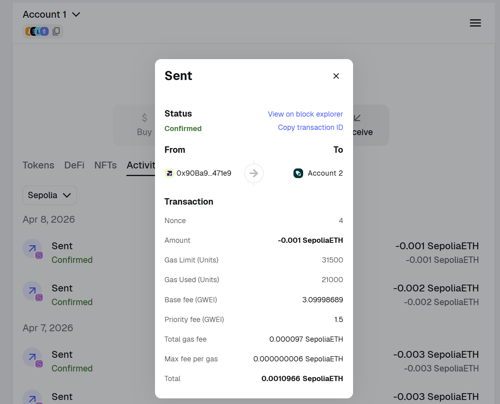
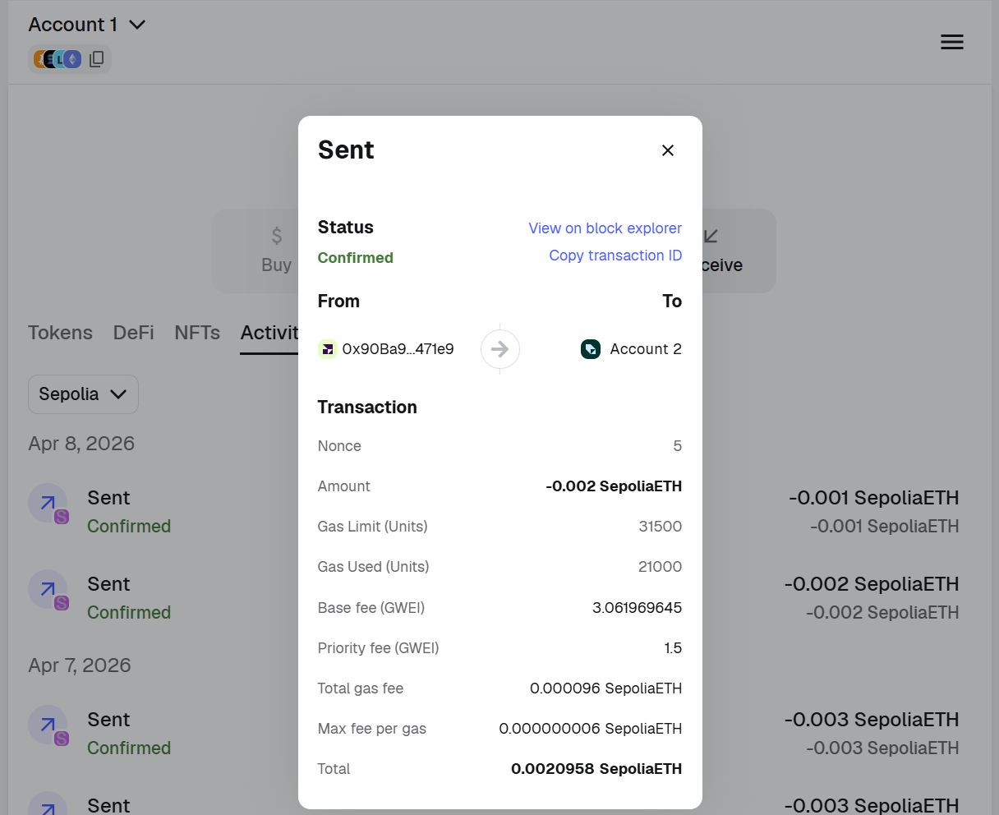
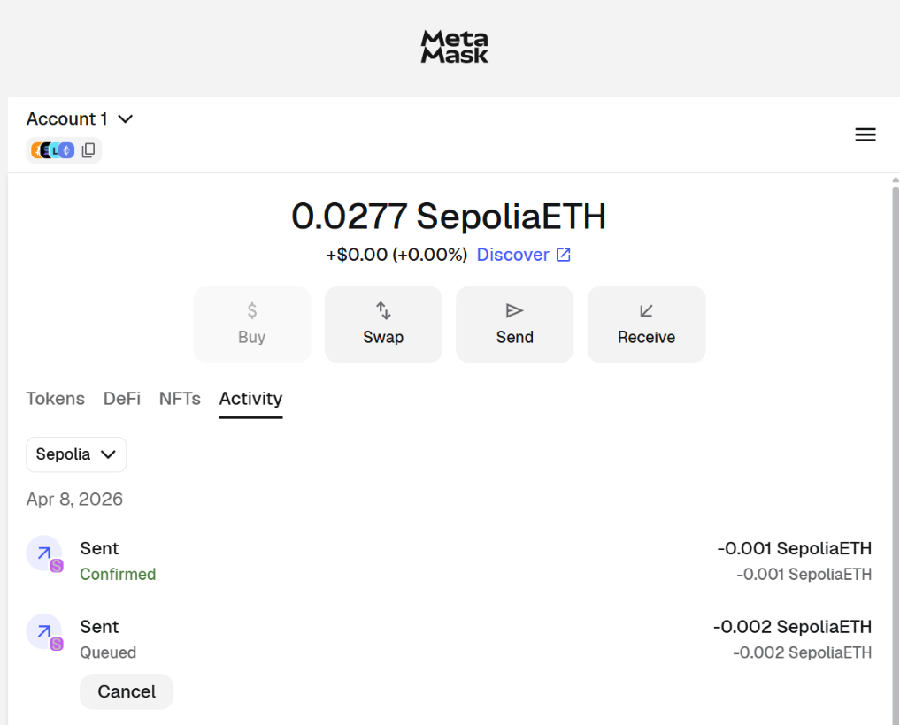

# Blockchain Practicalities - Assignment 3

## 1. Wallet
Metamask address - 0x90Ba964984c4EDcE1841ED54cd06CEa4b1F471e9

## 2. Chains
- Incoming transaction link: https://sepolia.etherscan.io/tx/0xaa910496011de1bea172c1253dfd5cf2c250be800f3f9a176f82d131813319ce

## 3. Transactions
- Transaction link: https://sepolia.etherscan.io/tx/0x230ce796e1f26f6d2d0859e3e3558d5e52c9b6abec58a566a5f7bd0a02791ab1

## 4. Gas
- Mainnet: Arbitrum Gas Tracker: https://arbiscan.io/gastracker
- Testnet: Arbitrum Sepolia Gas Tracker: https://arbitrum-sepolia.blockscout.com/gas-tracker

## 5. Nonce
- increased nonce:  https://sepolia.etherscan.io/tx/0xb8de8fc6536bb3a7d2737cd05e6b238cee3d0f3177ae6939f1cfb23e14516b11

- normal nonce: https://sepolia.etherscan.io/tx/0x531ac19139ff309883dd055e86a79f877ffa7d7268059256ca684ae51a5afd9f

### Activity logs:

